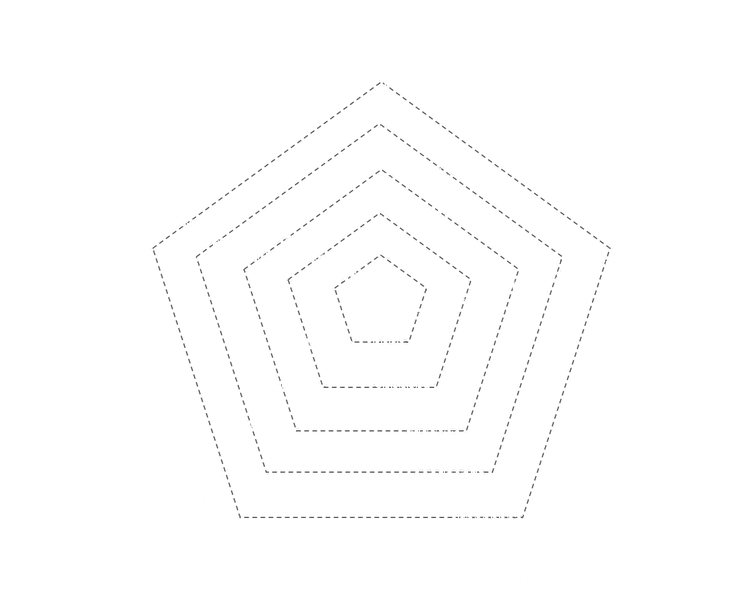

# Engineering Ladders

## Introduction

This framework allows software engineering managers to have meaningful conversations with direct reports around the expectations of each position and how to plan for the next level in their career ladder.

Although the framework uses roles and levels that are somewhat standard in the US tech industry, every company is different. Please use the information provided as a baseline and feel free adjust it to your needs.

The framework relies heavily in radar charts to show visually the different perspectives and expectations of a given position:

The chart above has 5 axes:
* **Technology**: knowledge of the tech stack and tools
* **System**: level of ownership of the system(s)
* **People**: relationship with the team(s)
* **Process**: level of engagement with the development process
* **Influence**: scope of influence of the person

The **influence** axis can be seen as a *different dimension* since it is orthogonal and applies to all the other axes.

Each axis has 5 different levels of performance. It is important to highlight that every level includes its previous one(s). For example, someone that *evangelizes* technology also *specializes* and *adopts*.

Keep reading to better understand each level.

## Technology

1. **Adopts**: actively learns and adopts the technology and tools defined by the team
2. **Specializes**: is the go-to person for one or more technologies and takes initiative to learn new ones
3. **Evangelizes**: researches, creates proofs of concept and introduces new technologies to the team
4. **Masters**: has very deep knowledge about the whole technology stack of the system
5. **Creates**: designs and creates new technologies that are widely used either by internal or external teams

## System

1. **Enhances**: successfully pushes new features and bug fixes to improve and extend the system
2. **Designs**: designs and implements medium to large size features while reducing the system's tech debt
3. **Owns**: owns the production operation and monitoring of the system and is aware of its SLAs
4. **Evolves**: evolves the architecture to support future requirenments and defines its SLAs
5. **Leads**: leads the technical excellence of the system and creates plans to mitigate outages

## People

1. **Learns**: quickly learns from others and consistently steps up when it is required
2. **Supports**: proactively supports other team members and helps them to be successful
3. **Mentors**: Mentors other to accelerate their career-growth and encourages them to participate
4. **Coordinates**: Coordinates team members providing effective feedback and moderating discussions
5. **Manages**: manages the team members' career, expectations, performance and level of happiness